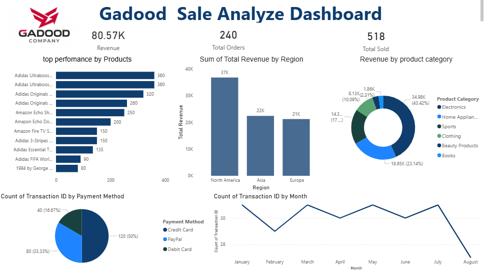

# 📊 Gadood Sales Analysis Dashboard

## 📝 Project Overview
This project is a comprehensive **Sales Performance Dashboard** developed for **Gadood Shop**. It provides a high-level overview of business health by tracking revenue, order volume, and sales trends, transforming raw sales data into actionable business insights.

## 🚀 Key Features
* **KPI Tracking:** Real-time visibility into Total Revenue ($80.57K), Total Orders, and Units Sold.
* **Product Performance:** Analysis of top-selling products (e.g., Adidas Ultraboost, Amazon Echo).
* **Regional Insights:** Breakdown of revenue across North America, Asia, and Europe.
* **Payment Analysis:** Comparison of transactions via Credit Card, PayPal, and Debit Card.
* **Monthly Trends:** Visualization of sales growth and seasonal patterns.

## 🛠️ Tools Used
* **Power BI:** For data visualization and dashboard design.
* **Excel / SQL:** Used for data cleaning, transformation, and preparation.
* **DAX:** Implemented custom measures for accurate financial and time-intelligence calculations.

## 📈 Dashboard Preview

## 💡 Business Impact
By using this dashboard, Gadood Shop can:
1. **Optimize Inventory:** Identify high-performing products to manage stock levels efficiently.
2. **Understand Customers:** Analyze payment and regional preferences to tailor the checkout experience.
3. **Strategic Planning:** Monitor monthly growth and seasonal trends to plan targeted marketing campaigns.

---
**Author:** Abdirahman Hussein  
**Role:** Data Analyst | Financial Accountant
